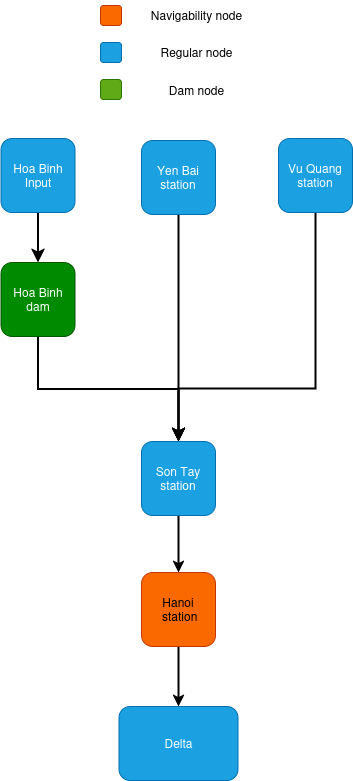

# AI4RedRiver

Data and tools for AI-driven water resource management in Vietnam's Red River basin. The primary use case is building and running a planner to schedule water releases from the Hoa Binh dam.

**Funding:** Climate Change AI project (No. IG-2023-174) — *"Artificial Intelligence for water management in the Red River Delta to meet the water demand and control saline intrusion in a changing climate"*

**Contact:** Prof. Ivan Serina — ivan.serina@unibs.it

<p align="center">
  
</p>

## Repository Structure

```
AI4RedRiver/
├── Datasets/
│   ├── available_data/
│   │   ├── in_situ/            ← Station observations (1989–2022)
│   │   ├── era5_land/          ← ERA5-Land reanalysis (2000–2022)
│   │   ├── copernicus_dem/     ← Copernicus DEM GLO-30 (30 m)
│   │   ├── global_dynamic_10m/ ← Land cover 10 m (2020)
│   │   └── soilgrids/          ← SoilGrids 2.0 (250 m)
│   ├── synthetic_datasets/     ← Scenario-modified datasets
│   └── weekly_datasets/        ← Weekly-aggregated data
├── dashboard_redriver/         ← Streamlit dashboard & planner
├── Examples/                   ← Example planner outputs
└── images/
```

## Datasets

### In-Situ Station Data
Daily observations from stations across the Red River basin (dam operations, rainfall, evaporation, temperature, water levels, energy production). Provided by Prof. Ngo Le An (Thuyloi University).
→ [Datasets/available_data/in_situ/README.md](Datasets/available_data/in_situ/README.md)

### ERA5-Land Reanalysis
Hourly gridded data (0.1°) for temperature, soil moisture, precipitation, evaporation, and vegetation indices over Northern Vietnam, 2000–2022.
→ [Datasets/available_data/era5_land/README.md](Datasets/available_data/era5_land/README.md)

### Copernicus DEM (GLO-30)
30 m Digital Elevation Model derived from TanDEM-X SAR imagery.
→ [Datasets/available_data/copernicus_dem/README.md](Datasets/available_data/copernicus_dem/README.md)

### Global Dynamic Land Cover (10 m)
Sentinel-2-derived land cover classification at 10 m resolution (2020).
→ [Datasets/available_data/global_dynamic_10m/README.md](Datasets/available_data/global_dynamic_10m/README.md)

### SoilGrids 2.0
Soil property maps at 250 m resolution from ISRIC.
→ [Datasets/available_data/soilgrids/README.md](Datasets/available_data/soilgrids/README.md)

### Synthetic Datasets
Scenario-modified versions of historical data with controlled changes to inflow, demand, and storage for stress-testing the planner.
→ [Datasets/synthetic_datasets/README.md](Datasets/synthetic_datasets/README.md)

### Weekly Datasets
Weekly-aggregated version of a subset of the historical data (`data_2001_2012_weekly.csv`) used as an alternative input resolution for the planner.

## Dashboard

A Streamlit-based dashboard for creating, visualising, and comparing water-release plans for the Hoa Binh dam.
→ [dashboard_redriver/README.md](dashboard_redriver/README.md)

## License

- **Copernicus data** (ERA5, DEM, Land Cover): Copernicus Data Access Policy — free for research and commercial use with attribution.
- **SoilGrids**: CC BY 4.0.
- **In-situ data**: CC BY 4.0.

## References

- D. Aineto, M. Battisti, H.Y. Nguyen, N.L. An, R. Ranzi, E. Scala, and I. Serina. "Leveraging AI Planning Models for the Water Management of the Red River Basin in Vietnam". *DaSET 2024*. **Best Paper Award**.
- H.Y. Nguyen, L.A. Ngo, L.L. Ngo, T.H. Gebremadhin, M. Peli, I. Serina, and R. Ranzi. "Optimal trade-off for operation of multi-purpose reservoir in the dry season". *EGU General Assembly 2024*.
- H.Y. Nguyen, L.L. Ngo, L.A. Ngo, M.C. Vu, M. Peli, I. Serina, R. Ranzi. "Multi-Purpose Reservoir Optimization Using Genetic Algorithm For The Hoa Binh Reservoir, Viet Nam". Submitted to *IDRA24*.