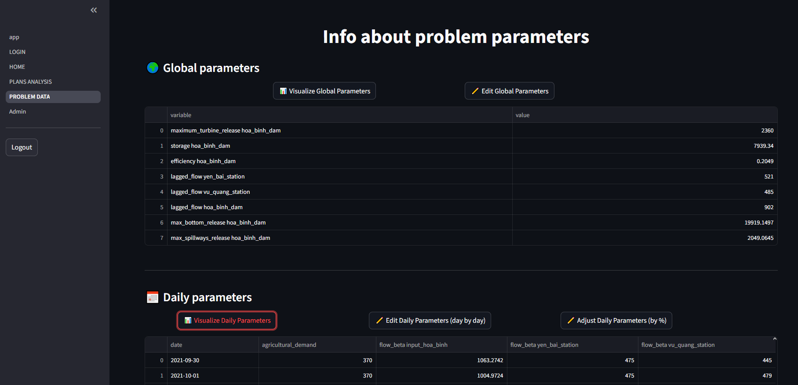
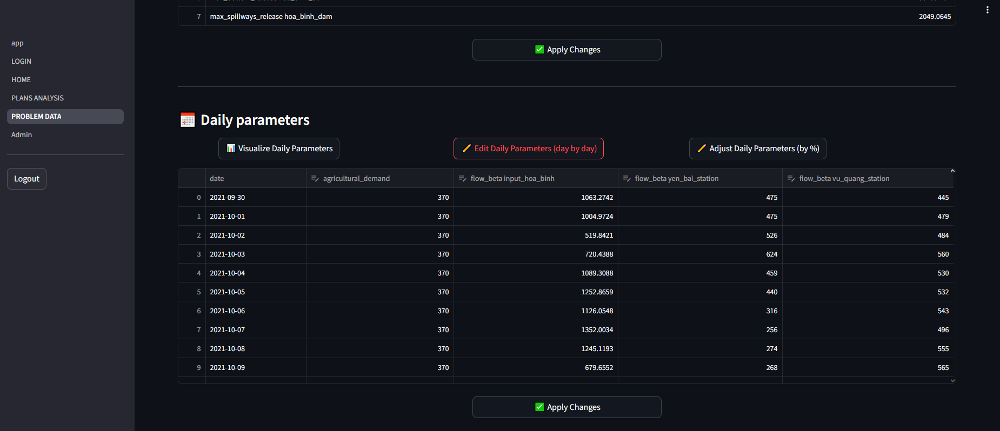
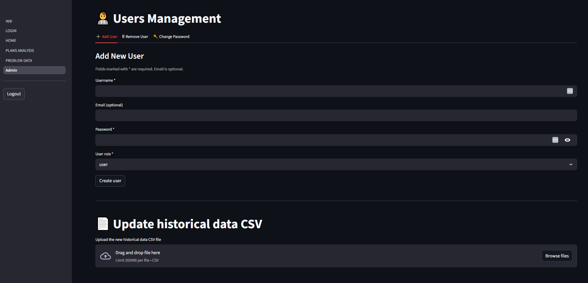

# Presentation

Below is a brief explanation of how the dashboard developed using Streamlit works.
The code has not been made publicly available because it contains sensitive data. To obtain the source code, please contact ivan.serina@unibs.it

# Usage
## Login
Once connected to the dashboard, the first page shown is the login page.

Using your credentials now you can login and use the dashboard.
The users' roles in this dashboard are:

 - **User**: This user has access to all dashboard features. except the "Admin" page
 - **Admin**: This user has access to all dashboard features. including the "Admin" page through which is possible to change users passwords, create/remove users and update historical data

## Home Page
Once logged, the user is redirected to the dashboard Homepage.

in the homepage there are two main sections:

 - **Load Saved Session**: the user can select a previously created session to load. Once selected the user can see the plots in the page "Plans Analysis" or edit some of the problem parameters and generate new plans in the page "Problem Data".
 - **Create Problem and Generate Plan**: the user now is asked to load a csv file containing the data to use to create the problem. Then, once selected a session_name, the planner create firstly the problem and domain files and then generates the plans using all the time specified before clicking the button. (Please do not refresh or change pages during plans generation).
 The uploaded data must be a csv file with the following columns (with these exacts names):
 
	| Date | Input_Hoa_Binh | Yen_Bai | Vu_Quang | Demand | H_Up (m) | Energy_demand |
	|--|--|--|--|--|--|--|

In order to be valid, the csv must follow these rules:

	- Dates must be contiguous  without gaps
	- Not containing negative values
	- All columns except *H_Up (m)* can't contain null values
	- First element (ascending date order) of the column *H_Up (m)* must be a valid value, while others value can be null since during computation only the first value is used

## Plans Analysis
Whether you arrived at this page after loading an existing session or after generating new plans for a new session, the initial view will look similar to the following image:

In the plot are shown the different plans based on their cumulative production and release. The user can select thorugh a drop-down menu which runs to show. The first "run" (with the first date) contains the valid plans generated during the sessione generation, the other "run" are from the parameters changes (each time problem data are changed and new palns generated, a new run is saved inside the session).
The main plot shows green and red dots:

 - **Green dots**: Plans that are valid with respect to the last problem version (the last edit of the problem data).
 - **Red dots**: Plans that are not valid with respect to the last problem version.

Selecting a plan by clicking on the plot allows the user to analyse the plan (a plot for the daily total water release. a plot for the daily energy production, a plot for the daily storage and a plot where is possibile to compare two selected features).

## Problem Data
The "Problem Data" page allows users to:
 - Visualize problem data. Data are separated in global data (parameters that do not have a daily value) and daily data (parameters that have a daily value).

 - Edit problem data in order to generate new plans after the change of some parameters but maintaining the same session.
Like the visualization, parameters are separated in global and daily. Daily parameters can be easily edited since they have a unique value, while daily values are more complex (there are two different edit mode available):
	 - **Edit daily parameters (day by day)**: It is possible to change the value of one or more specific days for each feature.

	 - **Adjust daily parameters (by %)**: For each feature, the average obtained from all the days is initially displayed, then the user can use a slider to increase or decrease this value by a given percentage. (What happens is that each daily value is increased/decreased based on the chosen percentage).

If the user changes some of the problem data, a new section is shown. In this section it is possible to generate new plans using this new data (a new run is created inside the session folder).

## Admin
The admin user can access the "Admin" page.

In this page is possible to

 - Add a new user/admin
 - Change a user/admin password
 - Remove a user/admin
 - update historical data. This is a csv file used to calculate coefficients for the plans generation.